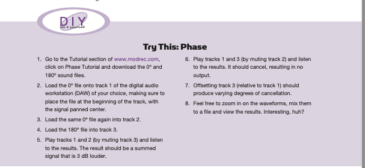
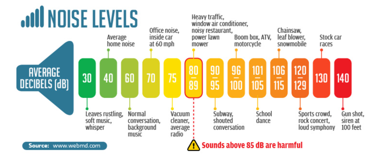
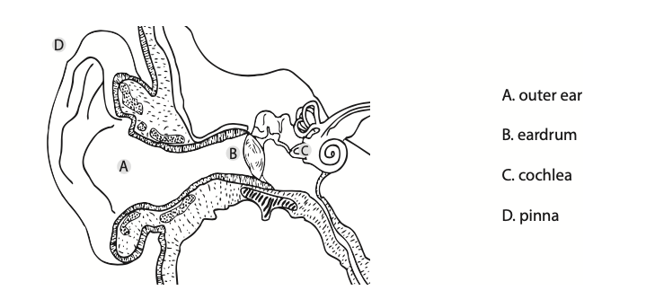
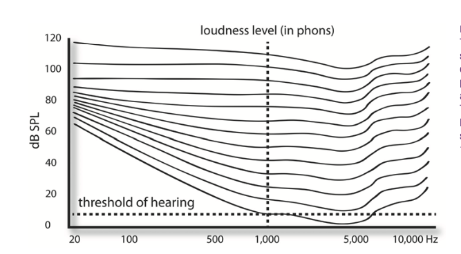

+++
title = "Sound and hearing"
outputs = ["Reveal"]
[reveal_hugo]
theme = "moon"
margin = 0.2
separator = "##"
+++

# Sound and hearing

{}
In order to understand the basics of audio production, we need to understand the basics of sound. Recording, sampling and synthesis all start and end with sound.

{}

---

## Sound areas

- The basics of sound
- The characteristics of the ear
- How the ear is stimulated by sound
- The psychoacoustics of hearing

---

The Transducer

device -> energy conversion -> resulting energy

<a href="https://commons.wikimedia.org/wiki/File:Django_Reinhardt_(Gottlieb_07301).jpg">William P. Gottlieb</a>, Public domain, via Wikimedia Commons

{}
ex:
guitar - vibrations -> amplified by wood -> converted into sound pressure waves that we percieve as sound

What types of devices could be considered transducers?

- microphone
- etc

{}

---

---

# The basics of sound

{}
Sound arrives at the ear in the form of periodic variations in atmospheric pressure called sound-pressure waves. This is the same atmospheric pressure that’s measured by the weather service; although, the changes in pressure heard by the ear are simply too small in magnitude and fluctuate too rapidly to be observed on a barometer.

It is sort of like when a ballon is popped

{}

---

{}
Any vibrating mass, such as the voice, or a guitar causes compression and rarefaction creating areas of high and low pressure states. These pressure states move the sound wave out from the source, allowing us to hear it.

This is a helpful diagram but this is not usually how we visualize sound. We do it with a waveform, a graphic representation of sound-pressure level. Looking at the waveform we can tell if the sound is quiet or loud and sometimes the frequency of the sound.
{}

---

## Amplitude

{}
The distance above or below the centerline of a waveform (such as a pure sine wave) represents the amplitude level of that signal. The greater the distance or displacement from that centerline, the more intense the pressure variation, electrical signal level or physical displacement will be within a medium.
{}

---

## Frequency

{}
The rate at which an acoustic generator, electrical signal or vibrating mass repeats within a cycle of positive and negative amplitude is known as the frequency of that signal.

We can also measure a frequency in cycles per second; (Hz) or hertz (Hz). An "A" note is 440 Hz.
{}

---

## Phase

{}
For simplicity’s sake, let’s limit our example to two pure tone waveforms (sine waves) that have equal amplitudes and frequency, but start their cyclic periods at different times. Such waveforms are said to be out of phase with respect to each other.

Out of phase signals can cause reductions in amplitude and are generally undesirable.

The example shows waves that either increase in amplitude, cancel altogether or combine. The last is more likely in practice.

Everyone should try the DIY activity on page 55 in the book to hear this for themselves.
{}

---

## Try this: Phase

---

## Harmonic content

{}
Most real life sounds are much more complex than a sine wave.

The factor that helps us differentiate between instrumental “voicings” is the presence of frequencies (called partials) that exist in addition to the fundamental pitch that’s being played. Partials that are higher than the fundamental frequency are called upper partials or overtones. If the overtones are whole-number multiples of the fundamental frequency, they are called harmonics.

Harmonics also form the basis of synthesis.

Now go tot he harmonics tutorial on modrec.com
{}

---

# The Decibel

{}
Loudness is variations in sound pressure level or SPL and is measured on a logarithmic scale in decibels (dB).
{}

---

# The Ear

{}
Sound is collected by the pinna. Then it travels through the eardrum, which vibrates converting sound-pressure waves into mechanical vibrations. The sound then goes to the cochlea, this snail looking organ covered in tiny hair receptors. It is here that we perceive frequencies of a sound.
{}

---

# Psychoacoustics

{}
This is not the end of the story. We now have to talk about psychoacoustics. The area of psychoacoustics deals with how and why the brain interprets a particular sound stimulus in a certain way. Although a great deal of study has been devoted to this subject, the primary device in psychoacoustics is the all- elusive brain, which is still largely unknown to present-day science.
{}

---

## Auditory Perception

{}
What sound comes into your ears is not always what you "hear", your brain completes the picture. Our ears perception of timbre and frequency changes with the loudness of a perceived signal

The Fletcher-Munson equal-loudness contour curves (Figure 2.26) indicate the ear’s average sensitivity to different frequencies at various levels. These indicate the sound-pressure levels that are required for our ears to hear frequencies along the curve as being equal in level to a 1000-Hz reference level (measured in phons).
{}

---

## Beats

<iframe width="560" height="315" src="https://www.youtube.com/embed/yia8spG8OmA" title="YouTube video player" frameborder="0" allow="accelerometer; autoplay; clipboard-write; encrypted-media; gyroscope; picture-in-picture" allowfullscreen></iframe>

{}
Two tones that differ only slightly in frequency and have approximately the same amplitude will produce an effect known as beats. What you'll hear is changes in amplitude. This is how many people tune instruments.

Lets do the DIY for beats on pg 68.
{}

---

## Combination Tones

<iframe width="560" height="315" src="https://www.youtube.com/embed/OiW8gzBGz1A?start=583" title="YouTube video player" frameborder="0" allow="accelerometer; autoplay; clipboard-write; encrypted-media; gyroscope; picture-in-picture" allowfullscreen></iframe>

{}
Combination tones result when two loud tones differ by more than 50 Hz. In this case, the ear perceives an additional set of tones that are equal to both the sum and the difference between the two original tones as well as being equal to the sum and difference between their harmonics.
{}

---

## Masking

{}
Masking is the phenomenon by which loud signals prevent the ear from hearing softer sounds. The greatest masking effect occurs when the frequency of the sound and the frequency of the masking noise are close to each other. For example, a 4 kHz tone will mask a softer 3.5 kHz tone but has little effect on the audibility of a quiet 1000 Hz tone.

Lets try the diy the modrec.com
{}
